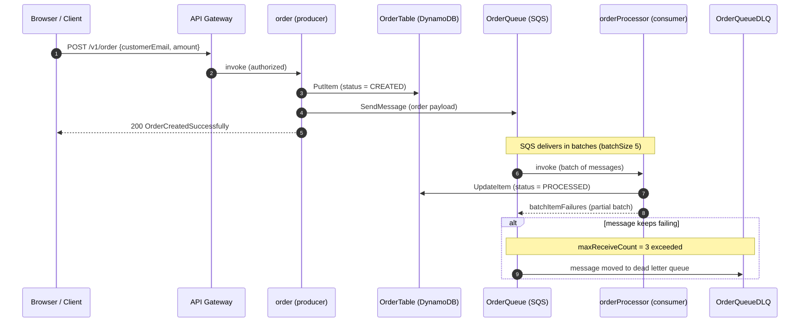

# Serverless Framework v4 — AWS TypeScript Reference Template

A production-style, well-commented **AWS Serverless** reference built with the
**Serverless Framework v4** and **TypeScript**. Use it as a quick development
guide for the most common serverless patterns.

> **Stack:** Serverless Framework v4 · TypeScript · Node.js 24 · AWS Lambda ·
> API Gateway (HTTP API v2) · DynamoDB · SQS · S3 · Cognito · SSM

---

## Table of contents

- [What's covered](#whats-covered)
- [Prerequisites](#prerequisites)
- [Project structure](#project-structure)
- [Quick start](#quick-start)
- [Configuration reference](#configuration-reference)
- [Patterns & features](#patterns--features)
  - [1. HTTP API + Lambda](#1-http-api--lambda)
  - [2. DynamoDB (CRUD, Query, Scan, GSI)](#2-dynamodb)
  - [3. Event-driven with SQS](#3-event-driven-with-sqs)
  - [4. S3 presigned URLs](#4-s3-presigned-urls)
  - [5. Scheduled (cron) events](#5-scheduled-cron-events)
  - [6. Custom authorizer (Cognito)](#6-custom-authorizer-cognito)
  - [7. SSM configuration](#7-ssm-configuration)
  - [8. Custom plugins](#8-custom-plugins)
- [TypeScript & build](#typescript--build)
- [Testing](#testing)
- [Linting](#linting)
- [Commands](#commands)
- [Troubleshooting](#troubleshooting)

---

## What it covers

| Pattern | Where |
| --- | --- |
| REST API via HTTP API Gateway v2 | `common`, `todo`, `order`, `upload` functions |
| DynamoDB CRUD, Query, Scan, GSI | `TodoTable`, `OrderTable`, `StatusTable` |
| Event-driven (producer → SQS → consumer) | `order` → `OrderQueue` → `orderProcessor` |
| Dead letter queue (DLQ) retry handling | `OrderQueue` + `OrderQueueDLQ` |
| S3 storage with presigned URLs | `UploadBucket` |
| Scheduled (cron) jobs | `dailyJob` |
| Lambda custom authorizer (Cognito) | `cAuthorizer` |
| SSM Parameter Store config | `provider.environment` |
| Custom plugins | `plugins/my-plugin.js` |
| Native TypeScript build (esbuild) | `build.esbuild` |

---

## Prerequisites

- **Node.js 24+** (`.nvmrc` pins `v24.15.0`)
- **pnpm** (the repo uses a `pnpm-lock.yaml`)
- **AWS credentials** configured (e.g. `aws configure` or environment variables)
- **Serverless Framework v4** — requires a one-time `serverless login` (or a
  license key) to run CLI commands. See [Troubleshooting](#troubleshooting).

```bash
npm i -g serverless
serverless login
```

---

## Project structure

```
.
├── serverless.yml                 # single source of truth for all AWS resources
├── tsconfig.json                  # TypeScript compiler options
├── jest.config.js                 # unit test config (ts-jest)
├── eslint.config.cjs              # ESLint flat config (TypeScript)
├── pnpm-workspace.yaml            # pnpm settings (build approvals)
├── plugins/
│   └── my-plugin.js               # example custom plugin
└── src/
    ├── handler.ts                 # Lambda entry point: cAuthorizer (Cognito)
    ├── handlers/
    │   └── createHttpHandler.ts   # factory: builds a per-feature lambda-api router
    ├── controller.ts              # base controller (validate → service → respond)
    ├── middlewares/
    │   └── cors.ts                # CORS middleware
    ├── utils/                     # shared helpers
    │   ├── constants.ts           # table/queue/bucket names, roles
    │   ├── dynamoDbHelper.ts      # DynamoDB DocumentClient wrappers
    │   ├── sqsHelper.ts           # SQS publish helpers
    │   ├── s3Helper.ts            # S3 presigned URL helpers
    │   ├── cognitoHelper.ts       # Cognito admin/user operations
    │   ├── authHelper.ts          # custom authorizer logic
    │   ├── responseHelper.ts      # success / error responses
    │   ├── errorHelper.ts         # Boom error mapping
    │   ├── validationHelper.ts    # Joi validation helpers
    │   └── commonHelper.ts        # timestamps, id generation
    └── functions/                 # one folder per feature
        ├── common/                # health check (handler + routes)
        ├── todo/                  # REST API + DynamoDB CRUD
        ├── order/                 # HTTP producer → SQS
        ├── orderProcessor/        # SQS consumer (event-driven)
        ├── upload/                # S3 presigned URLs
        └── dailyJob/              # scheduled cron job
```

Each feature follows the same layered pattern:

```
<feature>/handler.ts ──▶ routes.ts ──▶ controller ──▶ validation (Joi) ──▶ service ──▶ AWS SDK
```

Each HTTP feature has its own `handler.ts` + `routes.ts`. The shared `createHttpHandler` factory builds a `lambda-api` router (base `/v1`), wires CORS + preflight, then registers only that feature's routes — so every function bundles **only its own feature's code** (per-function scaling, deploy, and rollback).

---

## Architecture

```mermaid
flowchart LR
    C["Browser / Client"]

    subgraph HTTP ["HTTP API (API Gateway v2)"]
        AUTH["cAuthorizer<br/>Cognito token validation"]
        APIGW["API Gateway<br/>/v1/* routes"]
    end

    subgraph HTTPFunctions ["HTTP functions (each = own lambda-api router)"]
        F_COMMON["common<br/>health check"]
        F_TODO["todo<br/>REST CRUD"]
        F_ORDER["order<br/>producer"]
        F_UPLOAD["upload<br/>presigned URLs"]
    end

    subgraph Events ["Event-driven & scheduled"]
        Q["OrderQueue (SQS)"]
        DLQ["OrderQueueDLQ<br/>after 3 failed deliveries"]
        F_PROCESSOR["orderProcessor<br/>SQS consumer"]
        F_DAILY["dailyJob<br/>cron 02:00 UTC"]
    end

    subgraph Storage ["Storage"]
        T_STATUS[("StatusTable")]
        T_TODO[("TodoTable")]
        T_ORDER[("OrderTable<br/>+ GSI status+createdAt")]
        BUCKET[("UploadBucket (S3)")]
        SSM[("SSM Parameter Store")]
    end

    C --> APIGW
    APIGW --> AUTH
    AUTH -- Allow/Deny policy --> APIGW
    APIGW --> F_COMMON
    APIGW --> F_TODO
    APIGW --> F_ORDER
    APIGW --> F_UPLOAD

    F_COMMON --> T_STATUS
    F_TODO --> T_TODO
    F_ORDER --> T_ORDER
    F_ORDER -->|SendMessage| Q
    Q -->|invokes| F_PROCESSOR
    F_PROCESSOR --> T_ORDER
    Q -->|redrive| DLQ

    F_DAILY -->|Query GSI (status = CREATED)| T_ORDER
    F_DAILY -->|SendMessageBatch (re-publish stale)| Q

    F_UPLOAD -->|presigned URL| BUCKET
    C -->|PUT / GET directly| BUCKET

    SSM -.->|ALLOWED_ORIGINS etc.| APIGW
```

### Order flow (event-driven, end-to-end)



---

## Quick start

### 1. Install dependencies

```bash
pnpm install
```

### 2. Run locally (serverless-offline)

```bash
pnpm offline
```

This starts a local API Gateway + Lambda emulator on `http://localhost:5001`.
Local SSM values are provided by `serverless-offline-ssm` for the `local` stage.
The custom plugin skips AWS bucket operations during local development.

Try it:

```bash
curl http://localhost:5001/v1/common/status
```

> Note: `serverless offline` still requires the v4 login/license.

### 3. Deploy to AWS

```bash
pnpm deploy:dev        # sls deploy --stage dev --verbose
```

The deployment bucket is created/configured automatically by the custom plugin.

### 4. Remove

```bash
sls remove --stage dev
```

---

## Configuration reference

Everything lives in `serverless.yml`. Key sections:

| Section | Purpose |
| --- | --- |
| `build.esbuild` | Native TypeScript bundling (esbuild ships with v4) |
| `provider.httpApi` | HTTP API Gateway v2 config + custom authorizer |
| `provider.iam` | Least-privilege IAM role statements |
| `provider.environment` | Env vars (SSM, queue/bucket refs) |
| `functions` | Lambda functions + their event triggers |
| `resources.Resources` | Raw CloudFormation (DynamoDB, SQS, S3, ...) |
| `custom` | Plugin config (offline, prune, deployment bucket) |

### Stage resolution

Resource names are suffixed with the stage so environments can coexist:

```yaml
TableName: todo-${param:stage, self:provider.stage}
```

`--param stage=...` wins; otherwise the provider stage is used.

---

## Patterns & features

### 1. HTTP API + Lambda

HTTP functions share a single `lambda-api` router (`src/handler.ts`). Each
function is exposed via a `{proxy+}` path so it can scale independently:

```yaml
todo:
  handler: src/functions/todo/handler.run
  events:
    - httpApi:
        path: /v1/todo/{proxy+}
        method: any
        authorizer:
          name: customAuthorizer
```

The handler builds its own router via the shared factory, then registers only
the todo routes in `src/functions/todo/routes.ts`:

```ts
// src/functions/todo/handler.ts
export const run = createHttpHandler(registerTodoRoutes);

// src/functions/todo/routes.ts
api.post('/todo', createTodo);
api.get('/todo', listTodos);
api.get('/todo/:id', getTodo);
```

### 2. DynamoDB

Uses the high-level `DynamoDBDocumentClient` (`@aws-sdk/lib-dynamodb`) which
marshals JS values automatically — no `{ S: "..." }` boilerplate.

| Operation | Method | Example |
| --- | --- | --- |
| Create | `PutItem` | `createTodo` |
| Read one | `GetItem` | `getTodo` |
| List all | `Scan` | `listTodos` |
| Query by status | `Query` (GSI) | `listTodosByStatus` |
| Update | `UpdateItem` (dynamic expression) | `updateTodo` |
| Delete | `DeleteItem` | `deleteTodo` |

The `TodoTable` has a **Global Secondary Index** on `(status, createdAt)`
(`StatusIndex`) so filtering by status uses a cheap `Query` instead of a `Scan`:

```ts
await dbClientQuery({
  TableName: TABLE,
  IndexName: 'StatusIndex',
  KeyConditionExpression: '#status = :status',
  ExpressionAttributeNames: { '#status': 'status' },
  ExpressionAttributeValues: { ':status': status },
});
```

`buildUpdateExpression` (in `dynamoDbHelper.ts`) turns a partial object into a
dynamic `UpdateExpression`, enabling partial updates.

### 3. Event-driven with SQS

**Producer** (`order` function): writes the order to DynamoDB, then publishes
an event to the queue. The API responds immediately; heavy work happens later.

```ts
await dbClientPut({ TableName: DYNAMO_TABLE_ORDER, Item: order });
await sendMessage(SQS_ORDER_QUEUE_URL, message);
```

**Consumer** (`orderProcessor` function): triggered by the `sqs` event. SQS
delivers messages in batches; each record is processed independently.

```yaml
orderProcessor:
  handler: src/functions/orderProcessor/orderProcessor.run
  events:
    - sqs:
        arn: !GetAtt OrderQueue.Arn
        batchSize: 5
        maximumBatchingWindowInSeconds: 10
        functionResponseType: REPORT_BATCH_ITEM_FAILURES
```

**Dead letter queue:** the `OrderQueue` has a `RedrivePolicy` pointing to
`OrderQueueDLQ`. Messages that fail `maxReceiveCount` (3) times move to the DLQ
for inspection/replay.

### 4. S3 presigned URLs

The `upload` function returns short-lived URLs so clients can upload/download
files **directly to S3** without the file passing through Lambda:

```ts
const url = await getPresignedUploadUrl(bucket, key, 300);   // PUT
const url = await getPresignedDownloadUrl(bucket, key, 300); // GET
```

The bucket has CORS enabled so browsers can use the URLs.

### 5. Scheduled (cron) events

`dailyJob` runs daily at 02:00 UTC and republishes stale orders for processing:

```yaml
events:
  - schedule: cron(0 2 * * ? *)
```

### 6. Custom authorizer (Cognito)

`cAuthorizer` validates the Cognito access token via `GetUser` and returns an
Allow/Deny IAM policy plus a `context` object forwarded to the target Lambda:

```yaml
authorizers:
  customAuthorizer:
    type: request
    functionName: cAuthorizer
    identitySource:
      - $request.header.Authorization
```

The context (role, email, ...) is read in the controller:

```ts
const { requestContext: { authorizer: { lambda: extraData } = {} } } = req;
```

### 7. SSM configuration

Shared config is read from SSM Parameter Store with a fallback default:

```yaml
ALLOWED_ORIGINS: ${ssm:/${param:stage, self:provider.stage}/lambda/COMMON/ALLOWED_ORIGINS, "*"}
```

`serverless-offline-ssm` supplies local values for the `local` stage.

### 8. Custom plugins

`plugins/my-plugin.js` demonstrates the three plugin concepts — custom
`commands`, lifecycle `hooks`, and AWS API access via the provider. It manages
the deployment bucket (create, versioning, tags) on deploy.

---

## TypeScript & build

Serverless Framework v4 bundles **esbuild** natively — no plugin required.
Handlers are referenced as `.ts` files and bundled automatically on deploy.

```yaml
build:
  esbuild:
    bundle: true
    minify: false
    sourcemap: linked
    exclude:
      - '@aws-sdk/*'   # rely on the SDK already in the Lambda runtime
```

`@aws-sdk/*` is excluded from the bundle because the Lambda runtime already
provides it, keeping function bundles small.

---

## Testing

Unit tests use **Jest + ts-jest**:

```bash
pnpm test          # run once
pnpm test:unit     # watch mode
```

Tests mock the AWS SDK helpers (see `src/functions/todo/__tests__/`).

---

## Linting

```bash
pnpm lint          # ESLint
pnpm lint:fix      # auto-fix
pnpm typecheck     # tsc --noEmit
```

---

## Commands

| Command | Description |
| --- | --- |
| `pnpm start` | Run locally with serverless-offline (`:5001`) |
| `pnpm test` | Run unit tests |
| `pnpm lint` / `pnpm typecheck` | Lint / type-check |
| `pnpm deploy:dev` | Deploy to the `dev` stage |
| `pnpm package` | Package without deploying |
| `sls invoke local -f orderProcessor` | Invoke a function locally |
| `sls logs -f orderProcessor --tail` | Stream function logs |
| `sls remove --stage dev` | Tear down the stack |

---

## Troubleshooting

**`You must sign in or use a license key with Serverless Framework V.4`**
Serverless v4 requires authentication for CLI commands. Run `serverless login`
once, or set a `SERVERLESS_LICENSE_KEY` in CI.

**`ERR_PNPM_IGNORED_BUILDS`**
pnpm blocks dependency build scripts by default. This repo allows `esbuild` and
`serverless` via `allowBuilds` in `pnpm-workspace.yaml`.

**SSM parameter not found on deploy**
The `ALLOWED_ORIGINS` variable has a `"*"` fallback, so deploys succeed without
pre-provisioned parameters. Create the parameter to override it.

**`serverless offline` and SSM**
Use `--stage local` (the default script) so `serverless-offline-ssm` provides
the local parameter values.
